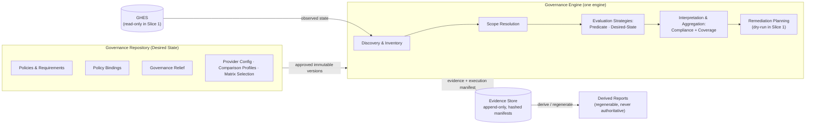

# [SUPERSEDED DRAFT — never published]

This draft predates ADR acceptance and uses retired terminology. The authoritative baseline is `architecture-baseline-v1.md`. This file is retained only until the baseline PR removes it.

# Architecture Baseline v1

## 1. Metadata

| Field | Value |
|---|---|
| Baseline Version | v1 |
| Status | Draft — pending PR approval |
| Published Date | 2026-07-14 |
| Phase Completed | Architecture Discovery Phase 1 |
| Current Phase | Phase 2 — Vertical Slice Specification |
| Supersedes | None (first baseline) |
| Superseded By | None |
| Architecture Version | **1.0.0** (initial — see §19) |
| Related ADRs | 0001–0012 (all **Proposed**) as merged in PR #1 (`d00c1a5`) |
| Recommended Repository Release | Annotated tag `arch-baseline-v1.0.0` on the baseline PR merge commit (recommendation only) |

---

## 2. Executive Summary

The GHES Governance Platform centrally governs GitHub Enterprise Server configuration in brownfield enterprises while minimizing disruption to development teams. Architecture discovery is complete: **one governance engine** evaluates version-controlled policies against discovered repository state using pluggable data sources but engine-owned semantics, records append-only evidence, and — when eventually permitted to write — remediates only through immutable, individually approved plans under hard change budgets. **Compliance** (are evaluable requirements met?) and **coverage** (are intended controls actually applied?) are independent reported dimensions. The first vertical slice is read-only against synthetic data.

## 3. Project Mission

Enable a large enterprise to improve security posture, governance consistency, audit readiness, operational visibility, and policy compliance on GHES — complementing, never replacing, existing delivery pipelines such as CircleCI. Governance is additive to platform ownership: GHES remains authoritative for everything no active policy governs.

## 4. Current Phase

**Phase 2 — Vertical Slice Specification.** Discovery is complete and consolidated; the immediate objective is a high-quality specification for the first end-to-end vertical slice. See `STATUS.md`.

## 5. Architecture Overview

- **Trust model** — the governance repository is the trusted source of desired state; merged PR into a protected branch = approved. The engine records provenance and never validates organizational authority (ADR-0002).
- **Pipeline** — discovery → inventory (universal) → scope resolution → evaluation → enforcement, strictly gated; attribute providers supply data under a three-result contract but never semantics (ADR-0003).
- **Activation** — Policy Bindings (policy version × scope expression × enforcement mode × evaluation role × effective period) carry rollout; modes are Observe/Plan/Enforce; authority is explicit (authoritative vs. shadow), never inferred (ADR-0004, ADR-0005).
- **Policy model** — composite policies of individually addressable requirements; technical evaluation separated from governance interpretation; deterministic aggregation (ADR-0006).
- **Compatibility** — a versioned capability matrix is the compatibility authority; compliance and coverage never flatten; capability gaps are findings (ADR-0007).
- **Relief** — Governance Exceptions (post-evaluation) and Exclusions (pre-evaluation) with mandatory expiry and loud lapse; *uncertainty never grants privilege* (ADR-0008).
- **Data** — authoritative evidence / operational logs / derived reports are distinct classes; evidence is append-only, minimal-but-sufficient, hash-manifested, independent of log level (ADR-0009).
- **Operations** — periodic reconciliation is the audit-bearing mechanism; executions declare scope, completeness, and freshness; the engine is a well-behaved GHES client (ADR-0010).
- **Remediation** — Enforce grants eligibility only; plans are immutable, hash-approved, precondition-bound, reversibility-classified, budget-limited; fail-stop by default (ADR-0011).
- **Unification** — one engine, multiple evaluation strategies (Predicate, Desired-State with Comparison Profiles); strategies are release-fixed engine capabilities; Drift is retired as a first-class concept (ADR-0012).

## 6. Architecture Diagram

Orientation only — authoritative detail lives in the ADRs and Domain Model.

## 7. Architectural Principles

Authoritative list: `architecture-principles.md`.

1. Policy-first governance
2. Explicit intent over inference
3. Uncertainty never grants privilege
4. Strategies compute facts; the engine owns governance meaning
5. Evidence is authoritative; reports are derived
6. Periodic reconciliation is authoritative; events are accelerators
7. Governance is additive to platform ownership
8. One governance engine, multiple evaluation strategies
9. Evaluation Role constrains execution authority
10. Restrictions may be inferred; authority may not
11. Compliance and Coverage are independent dimensions

## 8. Domain Overview

Authoritative model: `domain-model.md`; ubiquitous language: `CONTEXT.md` (60 terms). Capsule: desired-state entities (policies, requirements, scope expressions, bindings, relief, comparison profiles, provider configuration, plan approvals) are authored and governed via merged PR; engine releases own all semantics and closed sets; executions produce inventory, findings, plans, evidence, and manifests; reports are derived and never authoritative. Fourteen invariants are enumerated in Domain Model §5.

## 9. ADR Index (all Status: Proposed)

| ADR | Title | Decision in one line |
|---|---|---|
| 0001 | Policy-first hybrid governance model | Policy evaluation by default; exact desired state only for designated centrally managed controls |
| 0002 | Engine agnostic to organizational approval | Merged PR = approved; provenance recorded, authority never validated; governance repo is first centrally managed control |
| 0003 | Staged pipeline, extensible scope resolution | Universal observation; gated evaluation; providers pluggable under three-result contract; semantics core |
| 0004 | Policy bindings and enforcement modes | Mode attaches to versioned bindings; Observe/Plan/Enforce; bidirectional governed transitions |
| 0005 | Explicit binding authority | Authoritative vs. shadow declared, never inferred; ambiguity fails loud; fixed execution timestamp |
| 0006 | Composite policies, addressable requirements | Technical Outcome + Governance Interpretation → Requirement Outcome; deterministic aggregation |
| 0007 | Capability matrix; compliance vs. coverage | Versioned matrix is compatibility authority; coverage independent; capability gaps are findings |
| 0008 | Governance Relief; uncertainty grants nothing | Exceptions vs. Exclusions; mandatory expiry; loud lapse; scope reduction is not relief |
| 0009 | Evidence, logs, reports, retention | Three data classes; append-only hashed evidence; configurable retention lifecycle |
| 0010 | Periodic reconciliation execution model | Sweep is authoritative; declared scope; Complete/CompleteWithGaps/Failed; freshness visible |
| 0011 | Controlled remediation | Enforce = eligibility; hash-approved immutable plans; reversibility classes; hard change budgets |
| 0012 | Unified evaluation strategies | One engine; Predicate + Desired-State strategies; Comparison Profiles; Drift retired |

## 10. Current Scope (Vertical Slice 1 — read-only)

Synthetic repository inventory; GitHub-native attribute provider; scope resolution; predicate evaluation; composite policy evaluation; compliance calculation; coverage calculation; evidence generation; dry-run remediation plan generation. No writes to GitHub; no production integrations.

## 11. Deferred Scope

Production deployment; enterprise rollout; AWS infrastructure; runner implementation; ServiceNow integration; enterprise authentication; high availability; horizontal scaling; event-driven execution; automatic remediation; performance optimization. ADR-recorded future capabilities (standing remediation authority, runtime probing, control catalog, scope-diff control, evidence hardening, federation) are listed in `OPEN_ITEMS.md`. Deferred work is informational, not a backlog.

## 12. Repository Navigation

Recommended reading order:

1. `.ai/architecture/STATUS.md`
2. Latest Architecture Baseline (this document)
3. `.ai/architecture/domain-model.md`
4. `.ai/architecture/architecture-principles.md`
5. `CONTEXT.md` (glossary)
6. Relevant ADRs in `docs/adr/` (see §14)
7. Specifications (when they exist)

The Architecture Discovery Brief is historical context; newer artifacts win on conflict.

## 13. Open Architectural Items

Full register: `OPEN_ITEMS.md`. Summary: **one open architectural decision** — OI-1, the coverage aggregation rule (impacts ADR-0007); three pending editorial ADR amendments already dispositioned by Principles 9–10 (OI-2/3/4); specification-level items headed into `to-spec`; and the environmental-validation set inherited from the discovery brief's unknowns.

## 14. Recommended Reading (ADRs by topic)

- **Governance & trust** — ADR-0001, ADR-0002
- **Scoping & activation** — ADR-0003, ADR-0004, ADR-0005
- **Evaluation** — ADR-0006, ADR-0007, ADR-0012
- **Relief & interpretation** — ADR-0008
- **Evidence & data** — ADR-0009
- **Execution & operations** — ADR-0010
- **Remediation** — ADR-0011

## 15. What This Baseline Is

The authoritative architectural snapshot for the completed Architecture Discovery Phase 1, the primary onboarding document for engineers, architects, and AI sessions, and an index into the detailed artifacts: ADRs (`docs/adr/`), Domain Model, Architecture Principles, and glossary. Future sessions should read the latest baseline before consulting supporting artifacts.

## 16. What This Baseline Is Not

Not the specification, not an implementation guide, not the discovery brief, not the ADR collection, and not a design document. It introduces no architecture and resolves no contradictions; it reflects what has been decided elsewhere.

## 17. Next Baseline Trigger

Publish **architecture-baseline-v2** when **Vertical Slice 1 is complete** (implementation validates architecture) — or earlier if an architectural decision materially changes the model, such as resolving OI-1 with ADR changes or an ADR acceptance wave that alters status across the set.

## 18. Changes Since Previous Baseline

Not applicable — this is the first baseline.

## 19. Versioning

- **Baseline Version: v1.** First baseline; no predecessor exists.
- **Architecture Version: 1.0.0.** Initial version — Architecture Discovery Phase 1 produced the first complete, consolidated, internally consistent architecture (ADRs 0001–0012, Domain Model, Principles, glossary). There is no prior architecture version, so 1.0.0 establishes the reference point rather than recording a change. Expected bump guidance: the pending editorial amendments (OI-2/3/4) are **patch** (1.0.1); resolving OI-1 with a new engine-owned aggregation rule is **minor** (1.1.0); any change that alters the Domain Model's entities, invariants, or closed sets is **major** (2.0.0).
- **Repository Release: recommended, namespaced.** The completed phase is an architecture milestone, not a software release — no product exists yet, so a bare `v1.0.0` tag would misrepresent the repository. Recommendation: after the baseline PR merges, create annotated tag `arch-baseline-v1.0.0` on the merge commit and start `RELEASES.md` with this milestone entry. Product semantic versioning should begin only when Vertical Slice 1 ships. (Recommendation only — no tags created.)
