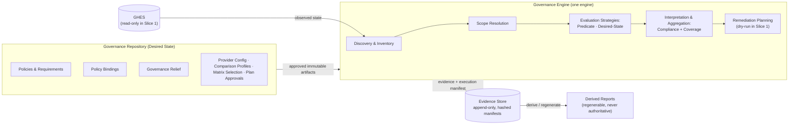

# Architecture Baseline v1

## 1. Metadata

| Field | Value |
|---|---|
| Baseline Version | v1 |
| Status | Published — pending merge to `main` (phase-gate condition) |
| Published Date | 2026-07-14 |
| Phase Completed | Architecture Discovery Phase 1 |
| Current Phase | Phase 2 — Vertical Slice Specification |
| Supersedes | None (first baseline) |
| Superseded By | None |
| Architecture Version | **1.0.0** (initial — see §19) |
| Related ADRs | 0001–0012, all **Accepted** 2026-07-14 |
| Phase Gate Review | PASS WITH CONDITIONS, 2026-07-14 (conditions documented in §13) |
| Recommended Repository Release | Annotated tag `v0.1.0` on the baseline PR merge commit (recommendation only) |

---

## 2. Executive Summary

The GHES Governance Platform centrally governs GitHub Enterprise Server configuration in brownfield enterprises while minimizing disruption to development teams. Architecture discovery is complete and **all twelve architectural decisions are accepted**: one governance engine evaluates version-controlled policies against discovered repository state using engine-owned semantics fed by extensible attribute providers, records append-only evidence, and — when eventually permitted to write — remediates only through immutable, hash-approved plans under intersection-composed constraints and hard change budgets. **Compliance** (are evaluable requirements met?) and **coverage** (are intended controls actually applied?) are independent reported dimensions, each with engine-owned aggregation. The first vertical slice is read-only against synthetic data.

## 3. Project Mission

Enable a large enterprise to improve security posture, governance consistency, audit readiness, operational visibility, and policy compliance on GHES — complementing, never replacing, existing delivery pipelines such as CircleCI. Governance is additive to platform ownership: GHES remains authoritative for everything no active policy governs.

## 4. Current Phase

**Phase 2 — Vertical Slice Specification.** Discovery, consolidation, acceptance, and the phase gate are complete; the immediate objective is a high-quality specification for the first end-to-end vertical slice. See `STATUS.md`.

## 5. Architecture Overview

- **Trust model** — governance process is separated from governance execution; the engine consumes Approved Artifacts and records provenance without judging authority; the governance repository is the first centrally managed control (ADR-0002).
- **Pipeline** — discovery → inventory (universal) → scope resolution → evaluation → enforcement, strictly gated; attribute providers supply normalized facts through an extensible provider seam and never evaluate policy (ADR-0003).
- **Activation** — Policy Bindings (policy version × scope expression × enforcement mode × evaluation role × effective period); modes Observe/Plan/Enforce; mode never determines authority (ADR-0004).
- **Authority** — explicit authoritative/shadow roles; at most one active authoritative binding per (policy, repository); zero is a normal rollout state producing no official interpretation; ambiguity fails loud; fixed evaluation timestamp per execution (ADR-0005).
- **Policy model** — composite policies of immutably-identified requirements; Technical Outcome and Governance Interpretation are separate dimensions; policy outcomes derive solely from engine-owned aggregation (ADR-0006).
- **Compatibility & coverage** — versioned capability matrix as compatibility authority; Coverage State (Covered / PartiallyCovered / Unknown) with Coverage Reasons (CapabilityGap / GovernanceExclusion / Unknown); compliance and coverage never flatten (ADR-0007).
- **Relief** — Governance Exceptions (post-evaluation) and Exclusions (pre-evaluation) with mandatory expiry, loud lapse, immutable renewal; governance scope is not a risk-acceptance mechanism; *uncertainty never grants privilege* (ADR-0008).
- **Data** — authoritative evidence / operational logs / derived reports; published evidence is immutable; report-to-manifest traceability is mandatory; retention lifecycle with governed disposal (ADR-0009).
- **Operations** — periodic reconciliation carries the audit guarantee (authority is per-tuple; the guarantee is per-estate); declared evaluation scopes; tuple-level supersession; Complete/CompleteWithGaps/Failed; result freshness is governance-visible (ADR-0010).
- **Remediation** — Enforce grants eligibility only; hash-bound Plan Approvals that can only narrow; asymmetric grant/removal channels with the emergency-suspension path explicitly deferred; per-operation authorization revalidation; reversibility classes; intersection-composed constraints; fail-stop (ADR-0011).
- **Unification** — one engine, multiple evaluation strategies (Predicate, Desired-State with Comparison Profiles); strategies are release-owned capabilities under an invariant contract; Drift retired as a first-class concept (ADR-0012).

## 6. Architecture Diagram

Orientation only — authoritative detail lives in the ADRs and Domain Model.

## 7. Architecture Principles

Authoritative list: `architecture-principles.md` (12 principles).

1. Policy-first governance
2. Explicit intent over inference
3. Uncertainty never grants privilege
4. Strategies compute facts; the engine owns governance meaning
5. Evidence is authoritative; reports are derived
6. Periodic reconciliation is authoritative; events are accelerators
7. Governance is additive to platform ownership
8. One governance engine, multiple evaluation strategies
9. Evaluation Role constrains execution authority
10. Restrictions may be applied conservatively under uncertainty; authority may never be inferred
11. Compliance and Coverage are independent dimensions
12. A governance tool must not degrade the platform it protects

## 8. Domain Overview

Authoritative model: `domain-model.md`; ubiquitous language: `CONTEXT.md`. Capsule: desired-state entities (policies, requirements, scope expressions, bindings, relief, comparison profiles, provider configuration, plan approvals, standing authority) are authored and governed via the trusted desired-state process; engine releases own all semantics and closed sets; executions produce inventory, findings, plans, evidence, and manifests; reports are derived and never authoritative. Fifteen invariants are enumerated in Domain Model §5.

## 9. ADR Index (all Status: Accepted, 2026-07-14)

| ADR | Title | Decision in one line |
|---|---|---|
| 0001 | Policy-first hybrid governance model | Policy evaluation by default; desired-state reconciliation only for designated centrally managed controls |
| 0002 | Governance process separated from execution | Engine consumes Approved Artifacts; provenance recorded, authority never validated; merged PR is the current process, not a permanent requirement |
| 0003 | Staged pipeline, extensible provider seam | Universal observation; gated evaluation; providers supply normalized facts under the three-result contract, never semantics |
| 0004 | Policy bindings and enforcement modes | Mode attaches to versioned bindings with evaluation roles; Observe/Plan/Enforce; mode never determines authority |
| 0005 | Explicit binding authority | At most one active authoritative binding; zero = no official interpretation; ambiguity fails loud; fixed execution timestamp |
| 0006 | Composite policies, addressable requirements | Immutable requirement identity; Technical Outcome vs Governance Interpretation; engine-owned aggregation only |
| 0007 | Capability matrix; compliance vs coverage | Versioned matrix authority; Coverage State + Coverage Reason with engine-owned aggregation; capability gaps are findings |
| 0008 | Governance Relief; uncertainty grants nothing | Exceptions vs Exclusions; mandatory expiry, loud lapse; governance scope is not a risk-acceptance mechanism |
| 0009 | Evidence, logs, reports, retention | Three data classes; immutable published evidence; mandatory report-to-manifest traceability; governed retention lifecycle |
| 0010 | Periodic reconciliation execution model | Authority per-tuple, audit guarantee per-estate; declared scopes; tuple-level supersession; freshness visible |
| 0011 | Controlled remediation | Enforce = eligibility; hash-bound narrowing approvals; asymmetric authority channels; intersection-composed constraints; fail-stop |
| 0012 | Unified evaluation strategies | One engine; release-owned strategies under an invariant contract; Comparison Profiles; Drift retired |

## 10. Current Scope (Vertical Slice 1 — read-only)

Synthetic repository inventory; GitHub-native attribute provider; scope resolution; predicate evaluation; composite policy evaluation; compliance calculation; coverage calculation; evidence generation; dry-run remediation plan generation. No writes to GitHub; no production integrations.

## 11. Deferred Scope

Production deployment; enterprise rollout; AWS infrastructure; runner implementation; ServiceNow integration; enterprise authentication; high availability; horizontal scaling; event-driven execution; automatic remediation; performance optimization. ADR-recorded future capabilities: standing remediation authority and the emergency-suspension path definition (ADR-0011), runtime capability probing (ADR-0007), control catalog (ADR-0006), scope-diff Requirement (ADR-0008), evidence hardening (ADR-0009), reactive execution (ADR-0010), authorship federation. Deferred work is informational, not a backlog.

## 12. Repository Navigation

Recommended reading order:

1. Latest Architecture Baseline (this document)
2. `.ai/architecture/STATUS.md`
3. `.ai/architecture/domain-model.md`
4. `.ai/architecture/architecture-principles.md`
5. `CONTEXT.md` (glossary)
6. Relevant ADRs in `docs/adr/` (see §14)
7. Specifications (when they exist)

The Architecture Discovery Brief is historical context; newer artifacts win on conflict. `ab-old.md` is a superseded, never-published draft.

## 13. Open Architectural Items

**No architectural decisions are open.** OI-1 through OI-5 were resolved and folded during the acceptance wave. The Phase Gate Review (PASS WITH CONDITIONS, 2026-07-14) recorded these conditions, discharged as follows:

1. **Land the accepted architecture on `main`** via branch and PR — the load-bearing condition; this baseline is not authoritative memory until merged.
2. **Restore an open-items/decision-log register** — to be recreated in the baseline PR.
3. **STATUS.md refresh** — done at this publication.
4. **Environmental unknowns** (GHES version, permissions, rate limits, metadata hygiene) — deferred by design; validated when the platform first touches a real GHES.
5. **`gh` CLI unavailable** on the working machine — release and issue-tracker logistics only.

Specification-level items (slice consolidation, schemas, scope-expression syntax, Expiring-threshold location, retention configuration, reporting personas) proceed into `to-spec`.

## 14. Recommended Reading (ADRs by topic)

- **Governance & trust** — ADR-0001, ADR-0002
- **Scoping & activation** — ADR-0003, ADR-0004, ADR-0005
- **Evaluation** — ADR-0006, ADR-0007, ADR-0012
- **Relief & interpretation** — ADR-0008
- **Evidence & data** — ADR-0009
- **Execution & operations** — ADR-0010
- **Remediation** — ADR-0011

## 15. What This Baseline Is

The authoritative architectural snapshot for the completed Architecture Discovery Phase 1, the primary onboarding document for engineers, architects, and AI sessions, and an index into the detailed artifacts: accepted ADRs, Domain Model, Architecture Principles, and glossary. Future sessions read the latest baseline first, before consulting supporting artifacts.

## 16. What This Baseline Is Not

Not the specification, not an implementation guide, not the discovery brief, not the ADR collection, and not a design document. It introduces no architecture and resolves no contradictions; it reflects what has been decided and accepted elsewhere.

## 17. Next Baseline Trigger

Publish **architecture-baseline-v2** when **Vertical Slice 1 is complete** (implementation validates architecture) — or earlier if an architectural decision materially changes the model (e.g. the emergency-suspension path definition, or any change to the Domain Model's entities, invariants, or closed sets).

## 18. Changes Since Previous Baseline

Not applicable — this is the first baseline.

## 19. Versioning

- **Baseline Version: v1.** First baseline; no predecessor exists.
- **Architecture Version: 1.0.0.** Initial version: Architecture Discovery Phase 1 produced the first complete, consolidated, internally consistent, and **accepted** architecture. Bump guidance: editorial/clarification changes → patch (1.0.1); new architectural capability (e.g. the emergency-suspension path, standing authority) → minor (1.1.0); changes to Domain Model entities, invariants, or closed sets → major (2.0.0).
- Repository Version: v0.1.1
